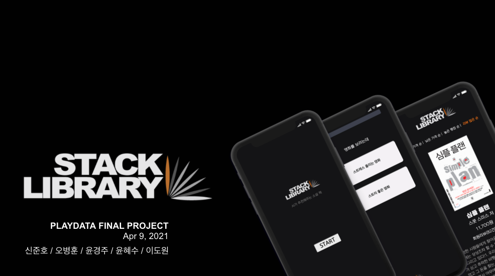

# Stack Library

 

 

플레이데이터 에서 진행한 최종발표 자료입니다.

본 프로젝트는 YES24의 데이터를 기반으로 Tf-IDF와 코사인 유사도를 사용한 

컨텐츠 기반 필터링 방법을 이용한 소설 추천 서비스를 주제로 진행한 프로젝트입니다.

 

## 팀원

- [신준호](https://github.com/ggwnsghgg)
- [오병훈](https://github.com/OHBEYOUNGHUN)
- [윤경주](https://github.com/GraceYoon281)
- [윤혜수](https://github.com/YHS20)
- [이도원](https://github.com/2dowon)

 

## 개발기간

2021.3.15 ~ 2021.4.09

 

## 개발환경

- Programming Language : Python 3.7.3
- WEB : HTML, CSS, JavaScript, Flask 1.1.2
- IDE
  - Google Colab
  - Visual Studio Code 1.43.2
- DataBase : MySQL 8.0.22
- Deployment : AWS
